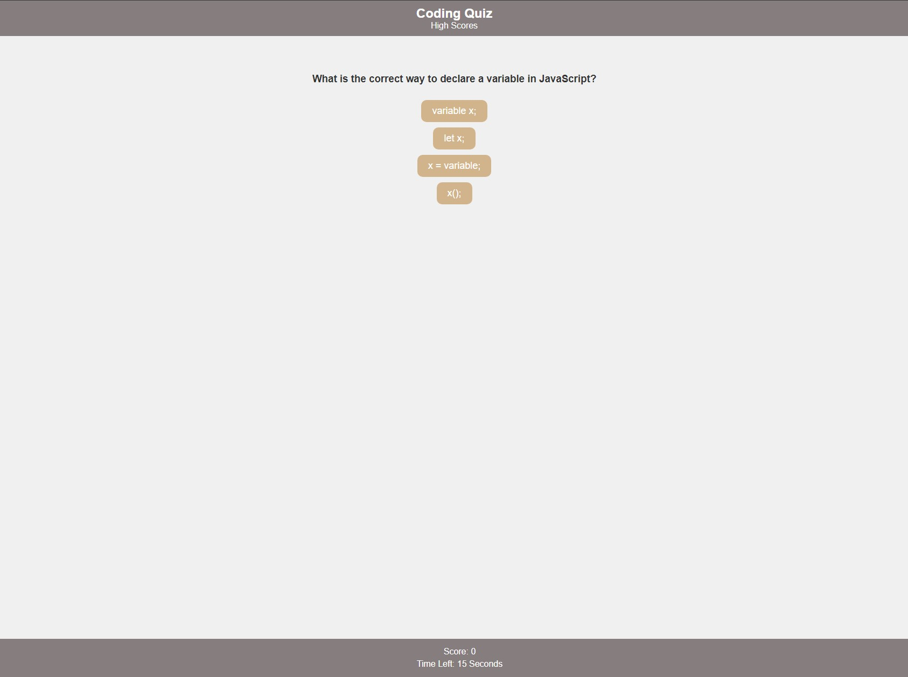

# Code-Quiz

## Description
The Coding Quiz Application is a web-based quiz game that tests your knowledge of coding concepts. The game consists of a series of questions, and your goal is to answer as many questions as possible within the given time limit.

# Features
## Start Button:

Clicking the "Start" button initiates the quiz.
A timer starts, and the first question is presented.
Question Flow:

After answering a question, the next question is displayed.
If an answer is incorrect, time is subtracted from the overall timer.

## Game Over:
The game ends when all questions are answered or when the timer reaches 0. Your remaining time and questions answered add to your score.

## Save Initials and Score:
After the game is over, you can save your initials and view your final score on the Highscore page.

## Usage
Open the application in your web browser.
Click the "Start" button to begin the quiz.
Answer each question by selecting the correct option.
If an answer is incorrect, time is deducted.
The game ends when all questions are answered or when the timer runs out.
After the game, enter your initials to save your score.

## Technologies Used
HTML
CSS
JavaScript

## Application screenshot and link

https://thomasjholtamiii.github.io/Code-Quiz/

## Installation
No installation is required. Simply open the provided HTML file in a web browser.
